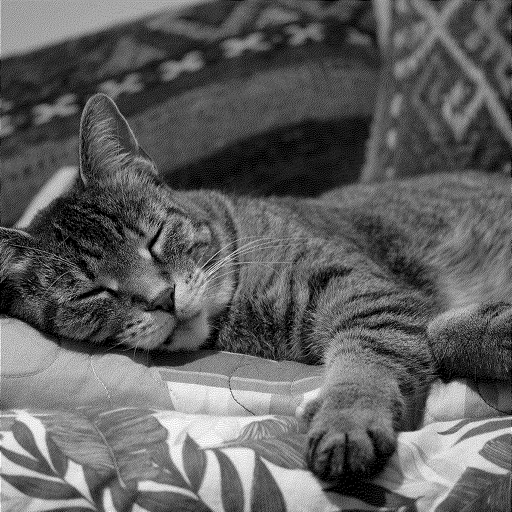
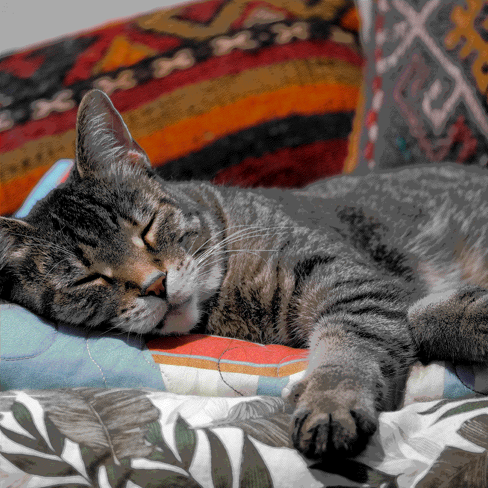

# Dither

`Dither` is a high-performance Elixir library for image processing and
dithering, powered by a Rust NIF using
[Rustler](https://github.com/rhex/rustler). It wraps the excellent
[`dither`](https://gitlab.com/efronlicht/dither) crate to provide fast,
high-quality dithering algorithms.

## Features

- **Format Support**: Load/save and encode/decode common image formats (PNG,
  JPEG, etc.).
- **Transformations**: Resize, flip, and grayscale conversion.
- **Dithering**: Support for 6 high-quality dithering algorithms.
- **Native Efficiency**: Heavy lifting is performed in Rust, while providing a
  clean, idiomatic Elixir interface.

## Showcase

Below are examples of `Dither` in action, generated from a single 1200x1200px
source image of my cat.

### Original Image (Resized)


### Grayscale Dithering

|                  Jarvis (1-bit)                   |                  Stucki (4-bit)                   |
| :-----------------------------------------------: | :-----------------------------------------------: |
|  |  |

### Color Dithering (Custom Palettes)

|            CGA Palette (Atkinson)             |              Websafe Palette (Sierra)               |         Crayon Palette (Floyd-Steinberg)         |
| :-------------------------------------------: | :-------------------------------------------------: | :----------------------------------------------: |
|  |  |  |

## Installation

Add `dither` to your list of dependencies in `mix.exs`:

```elixir
def deps do
  [
    {:dither, "~> 0.2.0"}
  ]
end
```

## Building from Source

By default, `Dither` uses
[RustlerPrecompiled](https://github.com/philss/rustler_precompiled) to provide
binaries for common platforms. If you need to build the NIF from source (e.g.,
for an unsupported architecture or for development), you must have Rust
installed and set the `DITHER_BUILD` environment variable:

```bash
DITHER_BUILD=true mix compile
```

## Usage

All public functions in the `Dither` module return or accept a `%Dither{}`
struct, which tracks the internal NIF reference along with image metadata.

### Basic Example

```elixir
# Load an image
image = Dither.load!("input.png")

# Inspect metadata
IO.inspect(image.size)      # {width, height}
IO.inspect(image.channels)  # 1 (grayscale) or 3 (RGB)

# Dither and save
image
|> Dither.grayscale!()
|> Dither.dither!(algorithm: :atkinson)
|> Dither.save!("output.png")
```

### Color Dithering with Custom Palettes

```elixir
image = Dither.load!("photo.jpg")

# Dither to the 16-color CGA palette
image
|> Dither.dither!(palette: :cga)
|> Dither.save!("retro_photo.png")

# Dither to a custom hex-based palette
image
|> Dither.dither!(palette: ["#000000", "#FF0000", "#00FF00", "#0000FF"])
|> Dither.save!("custom_colors.png")
```

### Dithering Options

The `dither/2` function supports the following options:

- `:algorithm`: The dithering algorithm to use (default: `:sierra`).
- `:bit_depth`: The target color depth (default: `1` for black and white).
- `:palette`: A list of colors to dither to. If provided, `:bit_depth` is
  ignored. Supported values:
  - List of RGB tuples: `[{255, 0, 0}, ...]`
  - List of Hex strings: `["#FF0000", ...]`
  - Predefined atoms: `:cga`, `:websafe`, `:crayon`
  - Simple color atoms: `:black`, `:white`, `:red`, `:green`, `:blue`,
    `:yellow`, `:cyan`, `:magenta`

#### Supported Algorithms

...

- `:floyd_steinberg`
- `:atkinson`
- `:stucki`
- `:burkes`
- `:jarvis`
- `:sierra` (default)

#### Bit Depth

The `:bit_depth` option controls the quantization level. For example:

- `bit_depth: 1` (default): 2 colors (Black & White).
- `bit_depth: 2`: 4 colors ($2^2$).
- `bit_depth: 4`: 16 colors ($2^4$).

## The Dither Struct

```elixir
%Dither{
  ref: reference(),      # The NIF resource reference
  size: {u32, u32},      # {width, height} tuple
  channels: 1 | 3        # Number of color channels
}
```

## License

This project is licensed under the MIT License - see the [LICENSE](LICENSE) file
for details.
